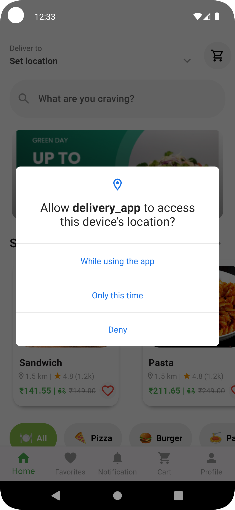
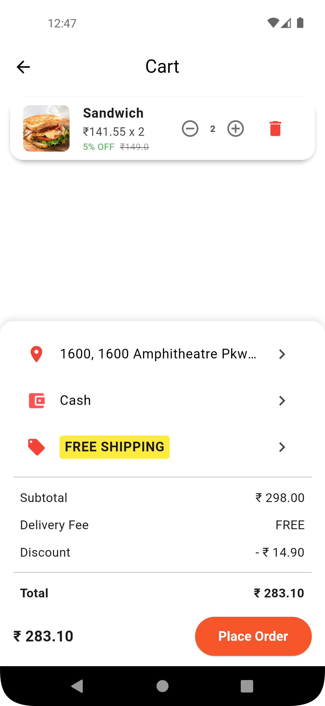
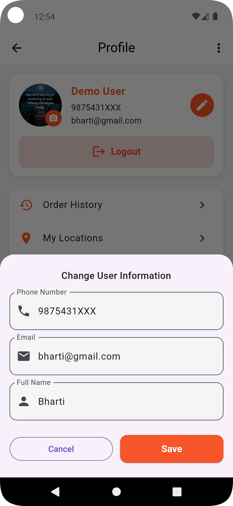

# Ecommerce Delivery App

A complete Flutter Ecommerce & Food Delivery App built with Provider State Management, and clean UI design. The app allows users to browse products, favorite item, add items to the cart,real-time location fetching, choose payment methods, placed orders, and order delivered within 30min.

## Features

- **Browse products & food items**  
- **Add / Remove items from Cart**   
- **Mark items as Favorite**    
- **Manage Quantity & Total Amount**    
- **Fetch Current Location (GPS integration)**    
- **Choose Payment Methods (Cash, UPI, Cards, etc.)**    
- **Place Orders & Get Delivery within **30 minutes**  
- **Responsive & Clean UI Design**    
- **Built with **Provider** for State Management**    

### Installation

1. **Clone or download the project**
   ```bash
   git clone https://github.com/bhartisahu09/Ecommerce-Food-Delivery-App
   cd delivery_app
   ```

2. **Install dependencies**
   ```bash
   flutter pub get
   ```

3. **Run the app**
   ```bash
   flutter run
   ```

## Screenshots

| Splash Screen | Onboarding Screen1 | Onboarding Screen2 | Onboarding Screen3 |
|:---:|:---:|:---:|:---:|
|  |  |  |  

| Onboarding Screen4 | Signup Screen | SignIn Screen | Location Permission |
|:---:|:---:|:---:|:---:|
|  |  |  |  |

| Home Screen1 | Home Screen2 | Filter Item | See All Items |
|:---:|:---:|:---:|:---:|
|  |  |  |  |

| Favorite Items| Favorite Screen | Favorite Item Remove | Item Details |
|:---:|:---:|:---:|:---:|
|  |  |  |  |

| Item Add in Card | Add Item Card Screen | My location | Add location |
|:---:|:---:|:---:|:---:|
|  |  |  |  |

| Location Add in Card| Payment Methods | Add Items | Order Placed Successfully |
|:---:|:---:|:---:|:---:|
|  |  |  |  |

| Profile Screen | Edit Profile Screen | Order History Screen | Logout |
|:---:|:---:|:---:|:---:|
|  |  |  |  |


